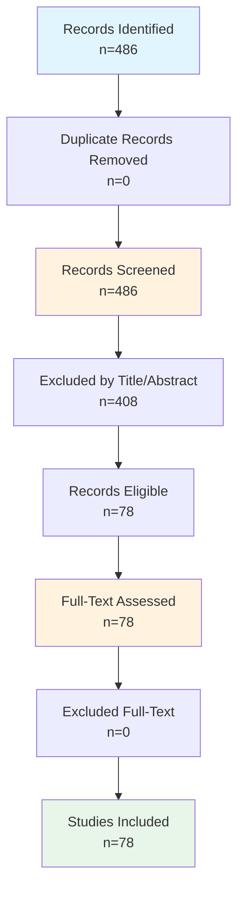

# Systematic Review Findings Report

**Date:** March 17, 2026
**Review Protocol:** PRISMA 2020 Guidelines

---

## Executive Summary

This systematic review identified **78 studies** meeting inclusion criteria.
The review followed PRISMA 2020 guidelines.

---

## 1. PRISMA Flow Diagram

### 1.1 Flow Statistics

| Stage | Count | Percentage |
|-------|-------|------------|
| Records identified | 486 | 100% |
| After duplicates removed | 486 | 100.0% |
| Screened | 486 | 100% |
| Excluded at title/abstract | 408 | 84.0% |
| Assessed for full-text | 78 | 16.0% |
| Excluded at full-text | 0 | 0.0% |
| **Studies included** | **78** | **16.0%** |

### 1.2 Mermaid Flowchart

### 1.3 Exclusion Reasons

---

## 2. Methods

### 2.1 Search Strategy

This systematic review searched the following databases: IEEE Xplore, Scopus, Web of Science, ACM Digital Library.
Search strings were developed following PRISMA 2020 guidelines.

### 2.2 Eligibility Criteria

| Criterion | Description |
|-----------|-------------|
| Language | English |
| Publication type | Journal articles, conference papers, preprints |
| Topic | Relevant to research question |

### 2.3 Screening Process

1. Records imported from databases and duplicates removed
2. Title and abstract screening using automated eligibility criteria
3. Full-text assessment for all included records
4. Data extraction for included studies
5. Quality assessment using Mixed Methods Appraisal Tool (MMAT)

---

## 3. Study Characteristics

### 3.1 Publication Year Distribution

| Year | Count |
|------------|------|
| 2020 | 13 |
| 2021 | 3 |
| 2022 | 12 |
| 2023 | 8 |
| 2024 | 17 |
| 2025 | 19 |
| 2026 | 6 |

### 3.2 Distribution by Source

| Source | Count |
|--------|-------|
| acm | 52 |
| ieee | 23 |
| scopus | 3 |
---

## 4. Quality Assessment

No quality assessment data available.
---

## 5. Included Studies

| Study_ID | Title | Year | Authors | Source |
| --- | --- | --- | --- | --- |
| REV001 | MDCV: a decentralized and collusion-resistant cons... | 2026 | Qin, Xuanmei (57197833340), Huang, Yongfeng (14627673100) | scopus |
| REV002 | Blockchain for e-healthcare: a review on secure da... | 2026 | Khan, Abdullah Ayub (57223873126), Baqasah, Abdullah M. (57433730800), Alsafyani, Majed (57215333357) | scopus |
| REV003 | A blockchain-based healthcare architecture for sec... | 2026 | T F, Michael Raj (60380191400), Uma Mageswari, R. (60380655900), S, Jerald Nirmal Kumar (59162844000) | scopus |
| REV004 | Blockchain-based chain of custody: towards real-ti... | 2020 | Ahmad, Liza, Khanji, Salam, Iqbal, Farkhund | acm |
| REV005 | Blockchain Based Digital Evidence Chain of Custody | 2020 | Yan, Wenqi, Shen, Jiachen, Cao, Zhenfu | acm |
| REV006 | Analysis of Web3 Platform Data Management Efficien... | 2026 | Shi, Jianzheng, Wang, Yue, Ow, Terence T. | acm |
| REV007 | A Blockchain Framework for Secure Storage of Resea... | 2024 | M, Madhu Rani, R, Buvana, S, Harini | acm |
| REV008 | Storage aware data management system for Genomics | 2024 | Shah, Zeeshan Ali, Farid, Mohsen | acm |
| REV009 | Improving Healthcare Data Management with Secure a... | 2025 | Sen, Madhumay, Mahalle, Parikshit N., Umare, Komal Baburao | acm |
| REV010 | Library resource sharing system and data managemen... | 2025 | Sun, Yuheng, Zhou, Wei, Deng, Lin | acm |
| REV011 | Design of Educational Data Management System with ... | 2025 | Hata, Yudai, Sakurai, Kouichi | acm |
| REV012 | Consensus in Data Management: With Use Cases in Ed... | 2024 | Nawab, Faisal, Sadoghi, Mohammad | acm |
| REV013 | Leveraging Blockchain for Enhanced Security in IOB... | 2023 | Zerhari, Btissam, Azbeg, Kebira, Jai Andaloussi, Said | acm |
| REV014 | A Survey of Blockchain Data Management Systems | 2022 | Wei, Qian, Li, Bingzhe, Chang, Wanli | acm |
| REV015 | Research on Sharing of University Scientific Resea... | 2024 | Wang, Yicai | acm |
| REV016 | Towards a Blockchain-Based System for Research Dat... | 2022 | Summers, Akira | acm |
| REV017 | Blockchain-based Secure Medical Data Management an... | 2022 | Wang, Meiquan, Zhang, Huiru, Wu, Haoyang | acm |
| REV018 | A Trusted Paradigm of Data Management for Blockcha... | 2022 | Wu, Yun, Wu, Liangshun, Cai, Hengjin | acm |
| REV019 | Design and Implementation of Blockchain-enabled Im... | 2022 | Toyoda, Kentaroh, Lim Kim Moh, Justin, Hsu Hlaing Mon, Nang | acm |
| REV020 | Fair and Robust Federated Learning via Decentraliz... | 2024 | Bowen, Du, Haiquan, Wang, Yuxuan, Li | acm |
| REV021 | Anonymous Storage and Verification Model of IIoT B... | 2022 | Liu, Tianhao, Liu, Jiqiang, Wang, Jian | acm |
| REV022 | A Blockchain-based System for Dataset Certificatio... | 2025 | Galletta, Antonino, Branca, Salvatore Gabriele, Reggio, Maria Teresa | acm |
| REV023 | CALYPSO: private data management for decentralized... | 2020 | Kokoris-Kogias, Eleftherios, Alp, Enis Ceyhun, Gasser, Linus | acm |
| REV024 | Atomic and Fair Data Exchange via Blockchain | 2024 | Tas, Ertem Nusret, Seres, Istv\'{a}n Andr\'{a}s, Zhang, Yinuo | acm |
| REV025 | A Neuro-Symbolic and Blockchain-Enhanced Multi-Age... | 2026 | Zhang, Tiantian | acm |
| REV026 | Event Detection and Trust Verification using Block... | 2025 | Khan, Amir Labib, Hasan, K. M. Azharul | acm |
| REV027 | DFTWS: Deterministic, Fair and Transparent Winner ... | 2025 | Hoffmann, Felix | acm |
| REV028 | AI-Enhanced Blockchain Networks for Climate Change... | 2025 | Gupta, Shubham, Vanteru, Kusumakumari, Reddy, Srinivas | acm |
| REV029 | A FAIR Public Permissioned Blockchain System for m... | 2025 | Daoulas, Christos, Sacharidis, Dimitris | acm |
| REV030 | FE[r]Chain: Enforcing Fairness in Blockchain Data ... | 2024 | Nuoskala, Camille, Rabbaninejad, Reyhaneh, Dimitriou, Tassos | acm |
| REV031 | Towards Complete Decentralised Verification of Dat... | 2020 | Ramachandran, Manoharan, Chowdhury, Niaz, Third, Allan | acm |
| REV032 | Honeybee: Byzantine Tolerant Decentralized Peer Sa... | 2025 | Zhang, Yunqi, Bojja Venkatakrishnan, Shaileshh | acm |
| REV033 | Accelerating Verifiable Queries over Blockchain Da... | 2025 | Hua, Yifan, Zheng, Shengan, Kong, Weihan | acm |
| REV034 | Certifichain: Secure QR Codes for Blockchain-Verif... | 2025 | Purwanto, Yudha, Faris Ruriawan, Muhammad, Virgono, Agus | acm |
| REV035 | FAIR-BFL: Flexible and Incentive Redesign for Bloc... | 2023 | Xu, Rongxin, Pokhrel, Shiva Raj, Lan, Qiujun | acm |
| REV036 | A semantic blockchain-based system for drug tracea... | 2023 | Masmoudi, Maroua, Mecharnia, Thamer, Bouhamoum, Redouane | acm |
| REV037 | SemNFT: A Semantically Enhanced Decentralized Midd... | 2024 | Lin, Lehao, Kang, Hong, Sun, Xinyao | acm |
| REV038 | CoVID-19 Vaccination Certificate Supply Verificati... | 2022 | Madhwal, Yash, Yanovich, Yury, Chumakov, Ilya | acm |
| REV039 | Know Your Transactions: Real-time and Generic Tran... | 2023 | Wu, Zhiying, Liu, Jieli, Wu, Jiajing | acm |
| REV040 | VeriDKG: A Verifiable SPARQL Query Engine for Dece... | 2023 | Zhou, Enyuan, Guo, Song, Hong, Zicong | acm |
| REV041 | PPM: A Provenance-Provided Data Sharing Model for ... | 2020 | Xu, Zhiyu, Wang, Qin, Wang, Ziyaun | acm |
| REV042 | Verifiable Results Privacy Protection Federal Lear... | 2024 | Qian, Yuhua, Hu, Tan, Han, Nian | acm |
| REV043 | SPBVPST : Towards Scalable and Private Blockchain ... | 2024 | Dehankar, Jiwan N., Sharma, Virendra Kumar | acm |
| REV044 | Verifier's Dilemma in Proof-of-Work Public Blockch... | 2025 | Smuseva, Daria, Marin, Andrea, Rossi, Sabina | acm |
| REV045 | Social Media Copyright Management using Semantic W... | 2020 | Garc\'{\i}a, Roberto, Gil, Rosa | acm |
| REV046 | Image data confirmation method based on security w... | 2024 | Zhang, Liu, Du, Xue-hui, Liu, Ao-Di | acm |
| REV047 | Identity Discovery in Bitcoin Blockchain: Leveragi... | 2020 | Christodoulou, Klitos, Iosif, Elias, Louca, Soulla | acm |
| REV048 | CLEAN: Cloud-enabled Scalable Blockchain Outsourci... | 2025 | Chan, Weilin, Wei, Yihang, Jiang, Peng | acm |
| REV049 | HELIPORT: A Portable Platform for {FAIR Workflow |... | 2021 | Knodel, Oliver, Voigt, Martin, Ufer, Robert | acm |
| REV050 | EventChain: a blockchain framework for secure, pri... | 2022 | Schwarz-R\"{u}sch, Signe, Behlendorf, Michael, Becker, Markus | acm |
| REV051 | ChainKV: A Semantics-Aware Key-Value Store for Eth... | 2023 | Chen, Zehao, Li, Bingzhe, Cai, Xiaojun | acm |
| REV052 | Research on Image Copyright Confirmation and Prote... | 2021 | Wang, Zhengliang, Li, Taijun | acm |
| REV053 | Bottom-up: A SGX-based Blockchain Trusted Startup ... | 2020 | Wang, Yichuan, Ma, Bing, Zhang, Tong | acm |
| REV054 | Demo: VaxPass -- A Scalable and Verifiable Platfor... | 2022 | Tian, Xiangan, Koutsos, Vlasis, Wu, Lijia | acm |
| REV055 | The combinatorics of the longest-chain rule: linea... | 2020 | Blum, Erica, Kiayias, Aggelos, Moore, Cristopher | acm |
| REV056 | Harnessing Blockchain to Transform Healthcare Data... | 2024 | Treiblmaier H, Rejeb A, Gault M | ieee |
| REV057 | Methods of medical data management based on blockc... | 2023 | Hovorushchenko T, Moskalenko A, Osyadlyi V. | ieee |
| REV058 | A Redactable Blockchain-Based Data Management Sche... | 2024 | Yang S, Li S, Chen W | ieee |
| REV059 | Healthcare and Fitness Data Management Using the I... | 2021 | Frikha T, Chaari A, Chaabane F | ieee |
| REV060 | PHDMF: A Flexible and Scalable Personal Health Dat... | 2022 | Ma L, Liao Y, Fan H | ieee |
| REV061 | A Novel Blockchain-Based Model for Secure Genomic ... | 2025 | Shaikh M, Ebrahimi A, Wiil UK. | ieee |
| REV062 | Data Validation and Verification Using Blockchain ... | 2020 | Hirano T, Motohashi T, Okumura K | ieee |
| REV063 | Proposed Implementation of Blockchain in British C... | 2020 | Cadoret D, Kailas T, Velmovitsky P | ieee |
| REV064 | Promoting TEFCA with Blockchain Technology: A Dece... | 2024 | Zhuang Y, Zhang L. | ieee |
| REV065 | A scalable blockchain based framework for efficien... | 2024 | Haque EU, Shah A, Iqbal J | ieee |
| REV066 | Blockchain-Based Trusted Data Management with Priv... | 2025 | Zhou H, Gao H, Ma Z | ieee |
| REV067 | N-Accesses: A Blockchain-Based Access Control Fram... | 2023 | Hu T, Yang S, Wang Y | ieee |
| REV068 | Scalable and efficient on-chain data management in... | 2025 | Ni E, Knight E, Gerstein M. | ieee |
| REV069 | Identifying the Barriers to Acceptance of Blockcha... | 2024 | Mutambik I, Lee J, Almuqrin A | ieee |
| REV070 | Feature Extraction Approach for Speaker Verificati... | 2022 | Upadhyay S, Kumar M, Kumar A | ieee |
| REV071 | A privacy preserving medical data management frame... | 2025 | Taloba AI, Rayan A. | ieee |
| REV072 | ACTION-EHR: Patient-Centric Blockchain-Based Elect... | 2020 | Dubovitskaya A, Baig F, Xu Z | ieee |
| REV073 | Retrieval Integrity Verification and Multi-System ... | 2024 | Zhou Z, Chen L, Zhao Y | ieee |
| REV074 | Under lock and key: Incorporation of blockchain te... | 2022 | Ramesh PV, Devadas AK, Ray P | ieee |
| REV075 | A Permissioned Blockchain Network for Security and... | 2020 | Lima VC, Bernardi FA, Alves D | ieee |
| REV076 | Food Safety Distribution Systems Using Private Blo... | 2025 | Oh SE, Kim JH, Kim JY | ieee |
| REV077 | A systematic study on blockchain technology for ge... | 2026 | Arya A, Malik A. | ieee |
| REV078 | Validation and user experience testing of DataCryp... | 2025 | Franc JM. | ieee |
---

## 6. Limitations

- **Language restriction:** English publications only
- **Database coverage:** May miss specialized sources
- **Classification based on title/abstract:** May have errors
- **Automated extraction:** Key findings require manual verification

---

---

*Report generated: March 17, 2026*