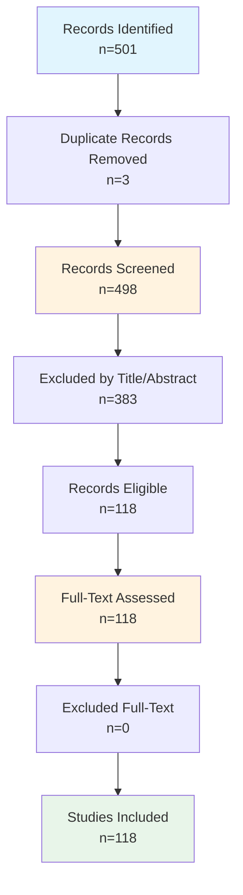

# Systematic Review Findings Report

**Date:** March 18, 2026
**Review Protocol:** PRISMA 2020 Guidelines

---

## Executive Summary

This systematic review identified **118 studies** meeting inclusion criteria.
The review followed PRISMA 2020 guidelines.

---

## 1. PRISMA Flow Diagram

### 1.1 Flow Statistics

| Stage | Count | Percentage |
|-------|-------|------------|
| Records identified | 501 | 100% |
| After duplicates removed | 498 | 99.4% |
| Screened | 498 | 100% |
| Excluded at title/abstract | 383 | 76.9% |
| Assessed for full-text | 118 | 23.7% |
| Excluded at full-text | 0 | 0.0% |
| **Studies included** | **118** | **23.7%** |

### 1.2 Mermaid Flowchart

### 1.3 Exclusion Reasons

---

## 2. Methods

### 2.1 Search Strategy

This systematic review searched the following databases: IEEE Xplore, Scopus, Web of Science, ACM Digital Library.
Search strings were developed following PRISMA 2020 guidelines.

### 2.2 Eligibility Criteria

| Criterion | Description |
|-----------|-------------|
| Language | English |
| Publication type | Journal articles, conference papers, preprints |
| Topic | Relevant to research question |

### 2.3 Screening Process

1. Records imported from databases and duplicates removed
2. Title and abstract screening using automated eligibility criteria
3. Full-text assessment for all included records
4. Data extraction for included studies
5. Quality assessment using Mixed Methods Appraisal Tool (MMAT)

---

## 3. Study Characteristics

### 3.1 Publication Year Distribution

| Year | Count |
|------------|------|
| 2020 | 22 |
| 2021 | 16 |
| 2022 | 22 |
| 2023 | 14 |
| 2024 | 17 |
| 2025 | 23 |
| 2026 | 4 |

### 3.2 Distribution by Source

| Source | Count |
|--------|-------|
| ieee | 78 |
| acm | 39 |
| scopus | 1 |

### 3.3 Research Focus Distribution

| Research Focus | Count |
|------------|------|
| Other | 84 |
| Provenance | 22 |
| Blockchain | 8 |
| Provenance; Blockchain | 4 |

### 3.4 Blockchain Platform Distribution

| Platform | Count |
|------------|------|
| Not specified | 118 |
---

## 4. Quality Assessment

### 4.1 Quality Ratings Distribution

| Rating | Description | Count |
|--------|-------------|-------|
| Excellent | Score 5 - clear methodology, rigorous evaluation | 1 |
| Good | Score 4 - minor methodological gaps | 6 |
| Acceptable | Score 3 - some concerns | 13 |
| Poor | Score 2 - significant gaps | 32 |
| Very_poor | Score 1 - cannot assess | 66 |

**Mean Quality Score:** 0.14 / 1.0

### 4.2 MMAT Item Scores

| MMAT Item | Yes | Can't tell | Rate |
|-----------|-----|------------|------|
| Clear Research Questions | 10 | 108 | 8.5% |
| Appropriate Methodology | 29 | 89 | 24.6% |
| Rigorous Data Collection | 7 | 111 | 5.9% |
| Sound Analysis | 33 | 85 | 28.0% |
| Well-supported Conclusions | 1 | 117 | 0.8% |
---

## 5. Included Studies

| Study_ID | Title | Year | Authors | Source |
| --- | --- | --- | --- | --- |
| REV001 | Ag aerogel/ZIF-8 nanocomposite as a sensitive and ... | 2026 | Xue, Xiangxin (55725917400), Wang, Zhuo (57845991500), Zhao, Cuimei (55476878500) | scopus |
| REV002 | Tilbot: A Visual Design Platform to Facilitate Ope... | 2023 | de Wit, Jan, Braggaar, Anouck | acm |
| REV003 | IO-SEA: Storage I/O and Data Management for Exasca... | 2024 | Medeiros, Daniel, Gregory, Eric B., Couvee, Philippe | acm |
| REV004 | Toward an Education Hub Linking Research Data and ... | 2025 | Floca, Melissa, O'Laughlin, Kate, Ramonetti Vega, Pedro | acm |
| REV005 | Consensus in Data Management: With Use Cases in Ed... | 2024 | Nawab, Faisal, Sadoghi, Mohammad | acm |
| REV006 | A Survey of Blockchain Data Management Systems | 2022 | Wei, Qian, Li, Bingzhe, Chang, Wanli | acm |
| REV007 | Research on Sharing of University Scientific Resea... | 2024 | Wang, Yicai | acm |
| REV008 | Blockchain-based Secure Medical Data Management an... | 2022 | Wang, Meiquan, Zhang, Huiru, Wu, Haoyang | acm |
| REV009 | Design and Implementation of Blockchain-enabled Im... | 2022 | Toyoda, Kentaroh, Lim Kim Moh, Justin, Hsu Hlaing Mon, Nang | acm |
| REV010 | Design and Implementation of Big Data Management P... | 2020 | Han, Bing, Chen, Zhenxiang, Liu, Cong | acm |
| REV011 | Research on Test Data Management Platform of Heavy... | 2022 | JIANG, NAN | acm |
| REV012 | AutoBench: A Holistic Platform for Automated and R... | 2025 | Parab, Arjun, Raoofy, Amir, Sp\"{o}rl, Leon | acm |
| REV013 | A Form and API Data Management Platform for Progre... | 2020 | Namee, Khanista, Phoarun, Rittiphon, Albadrani, Ghadeer Mohsen | acm |
| REV014 | Enabling a B+-tree-based data management scheme fo... | 2020 | Liang, Yu-Pei, Chen, Tseng-Yi, Chi, Ching-Ho | acm |
| REV015 | A Blockchain-based Co-Simulation Platform for Tran... | 2023 | Chen, Ye, Wu, Peilin, Li, Yuanliang | acm |
| REV016 | PSFQ: A Blockchain-Based Privacy-Preserving and Ve... | 2023 | Ni, Wangze, Chen, Pengze, Chen, Lei | acm |
| REV017 | Construction and Verification of an Intelligent Co... | 2026 | An, Zeting, Shao, Peng, Xv, Qianlin | acm |
| REV018 | DIV-DU: Data Integrity Verification and Dynamic Up... | 2024 | Zhao, Ning Ning, Jiang, Rui | acm |
| REV019 | Design of Verification Platform for Anti-Invasion ... | 2025 | Du, Chunhui | acm |
| REV020 | ChatCPU: An Agile CPU Design and Verification Plat... | 2024 | Wang, Xi, Wan, Gwok-Waa, Wong, Sam-Zaak | acm |
| REV021 | BPPV-Chain: A Sharding Blockchain System with Outp... | 2024 | Ding, Jinfeng, Hu, Qihua, Lin, Changkai | acm |
| REV022 | Universal Adaptive Construction of Verifiable Secr... | 2023 | Hayashi, Masahito, Koshiba, Takeshi | acm |
| REV023 | Research on SPARQL Semantic Query Technology Based... | 2022 | Zhang, Yabiao, Yu, Bihui, Wang, Jun | acm |
| REV024 | Dynamic Integrity Verification of Cloud Storage Da... | 2020 | Zhao, Wei, Jiang, Xiaoming, Wang, Jingchun | acm |
| REV025 | Construction and verification of a power simulatio... | 2024 | Guo, Qi, Zhang, Jie, Lu, Yuanhong | acm |
| REV026 | From “Non-separation of Adjudication and Managemen... | 2025 | Wang, Zhiqiang, Huang, Zimo, Xiao, Sheng | acm |
| REV027 | Multidimensional Information Systems Metadata Repo... | 2020 | Kuznetcov, Yevgeni, Fomin, Maxim, Vinogradov, Andrei | acm |
| REV028 | Multiplayer Space Invaders: A Platform for Studyin... | 2024 | Claure, Houston, Candon, Kate, Clark, Olivia | acm |
| REV029 | Secure Blockchain-Based Supply Chain Management wi... | 2023 | Botta, Vincenzo, Fusco, Laura, Mondelli, Attilio | acm |
| REV030 | Yugen SDL: Semantic Data Lake Design for Relationa... | 2024 | Zhang, Aaron, Weber, Gerald | acm |
| REV031 | PRODeep: a platform for robustness verification of... | 2020 | Li, Renjue, Li, Jianlin, Huang, Cheng-Chao | acm |
| REV032 | The Design Of UVM Verification Platform Based On D... | 2021 | Zhou, ShengYuan, Geng, ShuQin, Peng, XiaoHong | acm |
| REV033 | Space4HGNN: A Novel, Modularized and Reproducible ... | 2022 | Zhao, Tianyu, Yang, Cheng, Li, Yibo | acm |
| REV034 | SETLBI: An Integrated Platform for Semantic Busine... | 2020 | Deb Nath, Rudra Pratap, Hose, Katja, Pedersen, Torben Bach | acm |
| REV035 | HELIPORT: A Portable Platform for {FAIR Workflow |... | 2021 | Knodel, Oliver, Voigt, Martin, Ufer, Robert | acm |
| REV036 | Amplifying Artists’ Voices: Item Provider Perspect... | 2023 | Dinnissen, Karlijn, Bauer, Christine | acm |
| REV037 | Research on Image Copyright Confirmation and Prote... | 2021 | Wang, Zhengliang, Li, Taijun | acm |
| REV038 | Dragon: Decentralization at the cost of Representa... | 2024 | Feng, Hanwen, Lu, Zhenliang, Tang, Qiang | acm |
| REV039 | EasyDR: a human-in-the-loop error detection&amp;re... | 2022 | Xi, Yihai, Wang, Ning, Chen, Xinyu | acm |
| REV040 | HopsFS-S3: Extending Object Stores with POSIX-like... | 2020 | Ismail, Mahmoud, Niazi, Salman, Berthou, Gautier | acm |
| REV041 | Neuroscout, a unified platform for generalizable a... | 2022 | de la Vega A, Rocca R, Blair RW | ieee |
| REV042 | The Canadian Open Neuroscience Platform-An open sc... | 2023 | Harding RJ, Bermudez P, Bernier A, Beauvais M, Bellec P, Hill S, Karakuzu A, Knoppers BM, Pavlidis P, Poline JB, Roskams J, Stikov N, Stone J, Strother S, CONP Consortium, Evans AC. | ieee |
| REV043 | PEGR: a flexible management platform for reproduci... | 2022 | Shao D, Kellogg GD, Nematbakhsh A | ieee |
| REV044 | Qualitative Data Management and Analysis within a ... | 2020 | Antonio MG, Schick-Makaroff K, Doiron JM | ieee |
| REV045 | Codabench: Flexible, easy-to-use, and reproducible... | 2022 | Xu Z, Escalera S, Pavão A | ieee |
| REV046 | The Biomedical Research Hub: a federated platform ... | 2022 | Barnes C, Bajracharya B, Cannalte M | ieee |
| REV047 | Reproducibility of 20-min Time-trial Performance o... | 2022 | Matta G, Edwards A, Roelands B | ieee |
| REV048 | New frontiers in translational research: Touchscre... | 2021 | Sullivan JA, Dumont JR, Memar S | ieee |
| REV049 | BRIDGE: An Open Platform for Reproducible High-Thr... | 2020 | Senapathi T, Suruzhon M, Barnett CB | ieee |
| REV050 | QuNex-An integrative platform for reproducible neu... | 2023 | Ji JL, Demšar J, Fonteneau C | ieee |
| REV051 | Determination of Brain Tissue Samples Storage Cond... | 2022 | Pekov SI, Zhvansky ES, Eliferov VA | ieee |
| REV052 | Clinica: An Open-Source Software Platform for Repr... | 2021 | Routier A, Burgos N, Díaz M | ieee |
| REV053 | A versatile platform for locus-scale genome rewrit... | 2021 | Brosh R, Laurent JM, Ordoñez R | ieee |
| REV054 | An Overview of High-Throughput Crop Phenotyping: P... | 2024 | Yang W, Feng H, Hu X | ieee |
| REV055 | TerrestrialMetagenomeDB: a public repository of cu... | 2020 | Corrêa FB, Saraiva JP, Stadler PF, da Rocha UN. | ieee |
| REV056 | EMhub: a web platform for data management and on-t... | 2024 | de la Rosa-Trevin JM, Sharov G, Fleischmann S | ieee |
| REV057 | A new microfluidic platform for the highly reprodu... | 2022 | Protopapa G, Bono N, Visone R | ieee |
| REV058 | VirJenDB: a FAIR (meta)data and bioinformatics pla... | 2026 | Saghaei S, Siemers M, Ossetek KL | ieee |
| REV059 | Fast and Reproducible ELISA Laser Platform for Ult... | 2020 | Tan X, Chen Q, Zhu H | ieee |
| REV060 | PANOPLY: a cloud-based platform for automated and ... | 2021 | Mani DR, Maynard M, Kothadia R | ieee |
| REV061 | surveydown: An open-source, markdown-based platfor... | 2025 | Hu P, Bunea B, Helveston JP. | ieee |
| REV062 | Quantitative platform for accurate and reproducibl... | 2021 | Radunsky D, Stern N, Nassar J | ieee |
| REV063 | Verification of rice quality during storage after ... | 2023 | Chitsuthipakorn K, Thanapornpoonpong SN. | ieee |
| REV064 | A FAIR, open-source virtual reality platform for d... | 2024 | Reimer ML, Kauer SD, Benson CA | ieee |
| REV065 | Highly reproducible and cost-effective one-pot org... | 2023 | Zhang XS, Xie G, Ma H | ieee |
| REV066 | PeakForest: a multi-platform digital infrastructur... | 2022 | Paulhe N, Canlet C, Damont A | ieee |
| REV067 | BRIDGE: An Open Platform for Reproducible Protein-... | 2020 | Senapathi T, Barnett CB, Naidoo KJ. | ieee |
| REV068 | Storage Conditions of Human Kidney Tissue Sections... | 2020 | Lukowski JK, Pamreddy A, Velickovic D, Zhang G, Pasa-Tolic L, Alexandrov T, Sharma K, Anderton CR, Kidney Precision Medicine Project. | ieee |
| REV069 | Reproducible Manufacturing of SPOT as a High-throu... | 2025 | Cao R, Li NT, Shing CB | ieee |
| REV070 | The Dockstore: enhancing a community platform for ... | 2021 | Yuen D, Cabansay L, Duncan A | ieee |
| REV071 | Development and Evaluation/Verification of a Fully... | 2023 | Zhu H, Kim BJ, Spizz G | ieee |
| REV072 | PEERS - An Open Science "Platform for the Exchange... | 2021 | Sil A, Bespalov A, Dalla C | ieee |
| REV073 | VeVaPy, a Python Platform for Efficient Verificati... | 2022 | Parker C, Nelson E, Zhang T. | ieee |
| REV074 | Reproducible generation of human liver organoids (... | 2024 | Shrestha S, Lekkala VKR, Acharya P | ieee |
| REV075 | OpenGenomeBrowser: a versatile, dataset-independen... | 2022 | Roder T, Oberhänsli S, Shani N | ieee |
| REV076 | BakRep - a searchable large-scale web repository f... | 2024 | Fenske L, Jelonek L, Goesmann A | ieee |
| REV077 | Circuit response and experimental verification of ... | 2025 | Li Z, Fu K, Cheng Y | ieee |
| REV078 | Tracking the neural codes for words and phrases du... | 2024 | Desbordes T, King JR, Dehaene S. | ieee |
| REV079 | THRAISE: An automated and reproducible web platfor... | 2025 | Heo HH, Um SJ. | ieee |
| REV080 | Reproducible generation of human liver organoids (... | 2024 | Shrestha S, Lekkala VKR, Acharya P | ieee |
| REV081 | The instrumented sheep knee to elucidate insights ... | 2021 | Hart DA, Martin CR, Scott M | ieee |
| REV082 | Recombinant Yeast Platform for Production and Veri... | 2025 | Sultana MJ, Nishikawa M, Sudaka Y | ieee |
| REV083 | How does blockchain technology affect the developm... | 2023 | Jiang J, Li J, Wang W. | ieee |
| REV084 | Does platform type matter? A semantic analysis of ... | 2022 | Zhang L, Zhan G, Li Q | ieee |
| REV085 | A Nanozymatic-Mediated Smartphone Colorimetric Sen... | 2023 | Li W, Zhang X, Zhang H | ieee |
| REV086 | Reproducibility and accuracy of bacterial methylom... | 2025 | Schababerle T, Hayat O, Jung J | ieee |
| REV087 | Globally Accessible Distributed Data Sharing (GADD... | 2022 | Vazquez P, Hirayama-Shoji K, Novik S | ieee |
| REV088 | SaVor - A Reproducible Structural Variant Calling ... | 2025 | Mugoya T, Sethuraman A. | ieee |
| REV089 | A Streamlined High-Throughput Plasma Proteomics Pl... | 2023 | Woo J, Zhang Q. | ieee |
| REV090 | Cross-Platform Verification of Intermediate Scale ... | 2020 | Elben A, Vermersch B, van Bijnen R, Kokail C | ieee |
| REV091 | ShortCake: an integrated platform for efficient an... | 2025 | Nakato R, Nagai LAE. | ieee |
| REV092 | The Criminal Justice Administrative Records System... | 2022 | Finlay K, Mueller-Smith M, Papp J. | ieee |
| REV093 | Experimental Pipeline (Expipe): A Lightweight Data... | 2020 | Lepperød ME, Dragly SA, Buccino AP | ieee |
| REV094 | "METAGENOTE: a simplified web platform for metadat... | 2020 | Quiñones M, Liou DT, Shyu C | ieee |
| REV095 | Highly reproducible and sensitive electrochemical ... | 2022 | Cheng L, He Y, Yang Y | ieee |
| REV096 | Use of a Secure Web-Based Data Management Platform... | 2020 | Meholick AL, Jesneck JL, Thanawala RM | ieee |
| REV097 | BioArchLinux: community-driven fresh reproducible ... | 2025 | Zhang G, Ristola P, Su H | ieee |
| REV098 | PhyloSuite: An integrated and scalable desktop pla... | 2020 | Zhang D, Gao F, Jakovlić I | ieee |
| REV099 | How can we make GPS tracking studies more open, re... | 2025 | Malekzadeh M, Ha HJ, Sila-Nowicka K | ieee |
| REV100 | Reproducible, Scale-Up Production of Human Liver O... | 2025 | Shrestha S, Vanga MG, Jonnadula C | ieee |

*... and 18 more studies*
---

## 6. Limitations

- **Language restriction:** English publications only
- **Database coverage:** May miss specialized sources
- **Classification based on title/abstract:** May have errors
- **Automated extraction:** Key findings require manual verification

---

---

*Report generated: March 18, 2026*