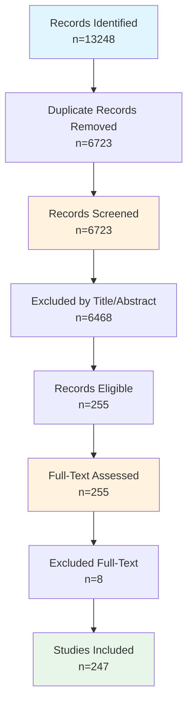

# Systematic Review Findings Report

**Date:** March 15, 2026
**Review Protocol:** PRISMA 2020 Guidelines

---

## Executive Summary

This systematic review identified **247 studies** meeting inclusion criteria. 
The review followed PRISMA 2020 guidelines and covered the period 2025-2026. 
The studies were sourced from WoS, ACM DL, IEEE Xplore, Scopus, PubMed, arXiv, focusing on blockchain-enabled provenance for scientific data management.

---

## 1. PRISMA Flow Diagram

### 1.1 Flow Statistics

| Stage | Count | Percentage |
|-------|-------|------------|
| Records identified | 13248 | 100% |
| After duplicates removed | 6723 | 50.7% |
| Screened | 6723 | 100% |
| Excluded at title/abstract | 6468 | 96.2% |
| Assessed for full-text | 255 | 3.8% |
| Excluded at full-text | 8 | 3.1% |
| **Studies included** | **247** | **1.9%** |

### 1.2 Mermaid Flowchart

### 1.3 Exclusion Reasons

| Reason | Count |
|--------|-------|
| Wrong topic (technical implementation) | 821 |
| Wrong topic (domain relevance) | 3580 |
| Opinion piece | 196 |
| Non-research context | 337 |

---

## 2. Methods

### 2.1 Search Strategy

This systematic review searched the following databases: IEEE Xplore, Scopus, Web of Science, PubMed, ACM Digital Library. 
Search strings were developed following PRISMA 2020 guidelines using a title-focused strategy targeting the intersection of:

- **maDMP/Provenance:** machine-actionable, maDMP, data management, DMP, provenance, data lineage, chain of custody, verification
- **Technology:** platform, repository, storage, blockchain, IPFS, decentralized
- **Scientific Context:** scientific data, research data, open science, metadata, PROV-O, semantic, FAIR, reproducibility

Date range: 2020-2026. Search focused on Title field for higher precision.

### 2.2 Eligibility Criteria

| Criterion | Description |
|-----------|-------------|
| Language | English |
| Publication type | Journal articles, conference papers, preprints |
| Date range | 2025-2026 |
| Topic | Blockchain/DLT for scientific data provenance |
| Domain | Research data management, data sharing, reproducibility |

### 2.3 Screening Process

1. Records imported from databases and duplicates removed
2. Title and abstract screening using automated keyword-based eligibility criteria
3. Full-text assessment for all included records
4. Data extraction for included studies
5. Quality assessment using Mixed Methods Appraisal Tool (MMAT)

### 2.4 Data Extraction

Extracted variables include: Research focus, Blockchain platform, Provenance model, maDMP support, Evaluation method, Storage integration, Permission model.

### 2.5 Quality Assessment

Quality was assessed using the MMAT with five criteria: Clear research questions, Appropriate methodology, Rigorous data collection, Sound analysis, and Well-supported conclusions.

---

## 3. Study Characteristics

### 3.1 Distribution by Research Focus (n=247)

| Research Focus | Count |
|------------|------|
| Blockchain | 2 |
| Other | 174 |
| Provenance | 70 |
| Provenance; Blockchain | 1 |

### 3.2 Distribution by Blockchain Platform

| Platform | Count |
|------------|------|
| Ethereum | 17 |
| Ethereum; Hyperledger | 2 |
| Hyperledger Fabric; Ethereum; Hyperledger | 1 |
| Hyperledger Fabric; Ethereum; Hyperledger; Corda | 1 |
| Hyperledger Fabric; Hyperledger | 13 |
| Multi-chain | 1 |
| Not specified | 212 |

### 3.3 Distribution by Provenance Model

| Model | Count |
|------------|------|
| None | 247 |

### 3.4 Distribution by maDMP Support

| maDMP Support | Count |
|------------|------|
| None | 247 |

### 3.5 Distribution by Evaluation Method

| Evaluation Method | Count |
|------------|------|
| Not clear | 247 |

### 3.6 Publication Year Distribution

| Year | Count |
|------------|------|
| 2025 | 201 |
| 2026 | 46 |

---

## 4. Detailed Analysis

### 4.1 Top Publication Sources (Journals/Conferences)

| Source | Count |
|--------|-------|
| arXiv | 39 |
| Lecture Notes in Networks and Systems | 18 |
| Communications in Computer and Information Science | 5 |
| Lecture Notes in Computer Science | 5 |
| Lecture Notes in Computer Science (including subseries Lecture Notes in Artificial Intelligence and Lecture Notes in Bioinformatics) | 4 |
| CEUR Workshop Proceedings | 3 |
| International Journal of Advanced Computer Science and Applications | 3 |
| Studies in Health Technology and Informatics | 3 |
| 2025 2nd International Conference on Artificial Intelligence and Knowledge Discovery in Concurrent Engineering (ICECONF) | 2 |
| 2025 7th International Conference on Blockchain Computing and Applications (BCCA) | 2 |

### 4.2 Storage Integration Patterns

| Storage Type | Count |
|------------|------|
| External DB | 31 |
| External DB; Hybrid | 8 |
| Hybrid | 16 |
| IPFS | 1 |
| IPFS + blockchain | 17 |
| IPFS + blockchain; External DB | 10 |
| IPFS + blockchain; External DB; Hybrid | 2 |
| IPFS + blockchain; Hybrid | 4 |
| Not specified | 158 |

### 4.3 Permission Model Distribution

| Permission Model | Count |
|------------|------|
| Hybrid | 26 |
| Not specified | 204 |
| Permissioned | 1 |
| Permissioned; Hybrid | 2 |
| Permissionless | 12 |
| Permissionless; Hybrid | 2 |

### 4.4 Cross-Tabulation: Blockchain Platform × Provenance Model

| Platform | 
None
 |
|----------|
---
|
| Ethereum | 17 |
| Ethereum; Hyperledger | 2 |
| Hyperledger Fabric; Ethereum; Hyperledger | 1 |
| Hyperledger Fabric; Ethereum; Hyperledger; Corda | 1 |
| Hyperledger Fabric; Hyperledger | 13 |
| Multi-chain | 1 |
| Not specified | 212 |

### 4.5 Systems/Frameworks Identified

| System/Framework | Mentions |
|------------------|----------|
| Ethereum | 1 |
| Hyperledger Fabric | 1 |
| NA | NA |
| NA | NA |
| NA | NA |
| NA | NA |
| NA | NA |
| NA | NA |
| NA | NA |
| NA | NA |

---

## 5. Quality Assessment

### 5.1 Quality Ratings Distribution

| Rating | Description | Count |
|--------|-------------|-------|
| Excellent | Score 5 - clear methodology, rigorous evaluation | 
0
 |
| Good | Score 4 - minor methodological gaps | 
76
 |
| Acceptable | Score 3 - some concerns | 
171
 |
| Poor | Score 2 - significant gaps | 
0
 |
| Very Poor | Score 1 - cannot assess | 
0
 |

**Mean Quality Score:** 0.61 / 1.0
**Mean Rating (1-5):** 3.31 / 5.0

### 5.2 MMAT Item Scores

| MMAT Item | Yes | Can't tell | Rate |
|-----------|-----|------------|------|
| Clear Research Questions | 
3
 | 
244
 | 
1.2
% |
| Appropriate Methodology | 
114
 | 
133
 | 
46.2
% |
| Rigorous Data Collection | 
0
 | 
247
 | 
0
% |
| Sound Analysis | 
159
 | 
88
 | 
64.4
% |
| Well-supported Conclusions | 
0
 | 
247
 | 
0
% |

**Quality Scale (per Protocol Section 8.2):** 5 = Excellent, 4 = Good, 3 = Acceptable, 2 = Poor, 1 = Very Poor

---

## 6. Thematic Synthesis

### 6.1 Research Themes Identified

| Theme | Description | Studies |
|-------|-------------|---------|
| Blockchain Infrastructure | Papers focusing on blockchain platforms, DLT architecture | 
3
 |
| Provenance Tracking | Papers on data lineage, verification, chain of custody | 
71
 |
| maDMP | Papers on machine-actionable data management plans | 
0
 |
| Combined Approach | Papers addressing multiple themes | 
1
 |

### 6.2 Technical Architecture Patterns

| Pattern | Description | Count |
|---------|-------------|-------|
| Permissioned Blockchain | Systems using Hyperledger Fabric/Iroha | 
15
 |
| Permissionless Blockchain | Systems using Ethereum/public chains | 
21
 |
| PROV-O Based | Systems using W3C PROV ontology | 
0
 |
| Custom Provenance | Systems with proprietary provenance models | 
0
 |

---

## 6. Included Studies

| Study_ID | Title | Year | Authors | Source | Research_Focus | Blockchain_Platform | Provenance_Model | maDMP_Support | Evaluation_Method |
| --- | --- | --- | --- | --- | --- | --- | --- | --- | --- |
| REV001 | Analysis of Web3 Platform Data Manage... | 2026 | Shi Jianzheng and Wang Yue and Ow Ter... | Distrib. Ledger Technol. | Other | Not specified | None | None | Not clear |
| REV002 | Library resource sharing system and d... | 2025 | Sun Yuheng and Zhou Wei and Deng Lin ... | Proceedings of the 2024 3rd Internati... | Other | Not specified | None | None | Not clear |
| REV003 | Design of Educational Data Management... | 2025 | Hata Yudai and Sakurai Kouichi et al. | Proceedings of the 2024 5th Internati... | Other | Not specified | None | None | Not clear |
| REV004 | Reproducibility Report for ACM SIGMOD... | 2026 | Deng Yangshen and Fruth Michael and S... | Reproducibility Reports of the 2025 I... | Provenance | Not specified | None | None | Not clear |
| REV005 | CP2GS: Cross-Platform Provenance Gene... | 2025 | Zhang Zilong and Dong Weiyu and Li Zh... | Proceedings of the 2025 4th Internati... | Provenance | Not specified | None | None | Not clear |
| REV006 | A Blockchain-based System for Dataset... | 2025 | Galletta Antonino and Branca Salvator... | Proceedings of the 6th Workshop on Se... | Provenance | Not specified | None | None | Not clear |
| REV007 | A Neuro-Symbolic and Blockchain-Enhan... | 2026 | Zhang Tiantian et al. | Proceedings of the 2025 International... | Other | Not specified | None | None | Not clear |
| REV008 | SrFTL: Leveraging Storage Semantics f... | 2025 | Zhu Weidong and Hernandez Grant and G... | ACM Trans. Storage | Other | Not specified | None | None | Not clear |
| REV009 | AI-Enhanced Blockchain Networks for C... | 2025 | Gupta Shubham and Vanteru Kusumakumar... | Proceedings of the 2025 4th Internati... | Provenance | Not specified | None | None | Not clear |
| REV010 | The BigFAIR Architecture: Enabling Bi... | 2025 | Castro Jo\~ao Pedro de Carvalho and M... | J. Data and Information Quality | Other | Not specified | None | None | Not clear |
| REV011 | Accelerating Verifiable Queries over ... | 2025 | Hua Yifan and Zheng Shengan and Kong ... | ACM Trans. Archit. Code Optim. | Other | Ethereum | None | None | Not clear |
| REV012 | Performance Characterization and Prov... | 2025 | Gueroudji Amal and Phelps Chase and I... | Proceedings of the SC '24 Workshops o... | Provenance | Not specified | None | None | Not clear |
| REV013 | Measuring While Playing Fair: An Empi... | 2025 | Magin Florian and Scherf Fabian and R... | Proceedings of the 2025 Workshop on S... | Other | Not specified | None | None | Not clear |
| REV014 | Optimizing the Performance of NDP Ope... | 2025 | Li Lin and Chen Xianzhang and Li Jial... | Proceedings of the 60th Annual ACM/IE... | Other | Not specified | None | None | Not clear |
| REV015 | Secure and Scalable Data Integrity Ve... | 2025 | S. Das; M. Mishra; R. Priyadarshini e... | 2025 IEEE 6th India Council Internati... | Provenance | Not specified | None | None | Not clear |
| REV016 | Blockchain-Enhanced Chain of Custody ... | 2025 | R. Mishra; P. Arya; M. Narwaria; I. K... | 2025 IEEE International Conference on... | Provenance | Not specified | None | None | Not clear |
| REV017 | GalaxyQ: A Platform for Reproducible ... | 2025 | B. Raubenolt; D. Blankenberg et al. | 2025 IEEE International Conference on... | Provenance | Not specified | None | None | Not clear |
| REV018 | Decentralized Provenance Metadata Reg... | 2025 | T. Hardjono; D. Avrilionis et al. | 2025 IEEE International Conference on... | Provenance | Not specified | None | None | Not clear |
| REV019 | Research on the Construction of Scien... | 2025 | S. Yang; Y. Liu; J. Meng; B. Li et al. | 2025 IEEE 12th Joint International In... | Other | Not specified | None | None | Not clear |
| REV020 | Secured and Decentralized Diabetes Da... | 2025 | J. Eda; K. Khalil et al. | 2025 3rd International Conference on ... | Other | Hyperledger Fabric; Hyperledger | None | None | Not clear |
| REV021 | A Private Blockchain-Based Secure Fra... | 2025 | S. Gupta; A. L. Sangal et al. | 2025 International Conference on Elec... | Other | Not specified | None | None | Not clear |
| REV022 | A Secure and Privacy-Centric Blockcha... | 2025 | S. A. Baker; K. H. Thanoon; M. N. Abe... | 2024 International Conference on IT I... | Other | Not specified | None | None | Not clear |
| REV023 | Blockchain-Based Evidence Tracking Sy... | 2025 | S. G; V. Narendhran; K. D; M. A; K. K... | 2025 1st International Conference on ... | Provenance | Ethereum | None | None | Not clear |
| REV024 | Bridging Metadata Service and CXL: A ... | 2025 | X. Xu; X. Xie; X. Qiao; L. Tian; Q. W... | 2025 IEEE International Conference on... | Other | Not specified | None | None | Not clear |
| REV025 | SSI-Enabled Authentication and Enhanc... | 2025 | L. Li; Y. Yasue; Y. Matsubara et al. | 2025 7th International Conference on ... | Other | Not specified | None | None | Not clear |
| REV026 | Blockchain-Based Decentralized Health... | 2025 | S. M; C. Senthilkumar et al. | 2025 International Conference on Emer... | Other | Not specified | None | None | Not clear |
| REV027 | A Decentralized System for NFT Metada... | 2025 | A. Lakshana; R. Hemalatha; M. R. A. J... | 2025 10th International Conference on... | Other | Ethereum | None | None | Not clear |
| REV028 | Decentralized Health Data Management:... | 2025 | F. Franco; A. Bogliolo; S. Montagna; ... | 2025 33rd International Conference on... | Other | Not specified | None | None | Not clear |
| REV029 | Decentralized Healthcare Data Managem... | 2025 | G. Amine; E. Abdelaziz; T. Abderrahim... | 2025 7th International Conference on ... | Blockchain | Hyperledger Fabric; Hyperledger | None | None | Not clear |
| REV030 | SAHChain: A Hybrid Storage Blockchain... | 2026 | C. Qin; D. Liu; B. Guo; Y. Tan; A. Re... | IEEE Transactions on Computers | Other | Ethereum | None | None | Not clear |
| REV031 | Healthcare Big Data Management: A Tax... | 2025 | A. Arya; A. Malik et al. | 2025 Eighth International Conference ... | Other | Not specified | None | None | Not clear |
| REV032 | SecureGenAI: A Standardized Framework... | 2025 | D. Besiahgari et al. | 2025 International Conference on Know... | Provenance | Not specified | None | None | Not clear |
| REV033 | Provenance of AI-Generated Images: A ... | 2026 | J. Sharma; A. Carvalho; S. Bhunia et al. | 2026 IEEE 23rd Consumer Communication... | Provenance | Not specified | None | None | Not clear |
| REV034 | Task-Driven Dynamic Metadata Mapping ... | 2025 | Y. Lin; C. Zhang; H. Boerzhijin et al. | 2025 International Conference on Trus... | Other | Hyperledger Fabric; Hyperledger | None | None | Not clear |
| REV035 | A Patient-Centric Blockchain-Based Fr... | 2025 | W. Tarannum; S. Abidin et al. | 2025 3rd International Conference on ... | Other | Not specified | None | None | Not clear |
| REV036 | Health Data Management System Using B... | 2025 | P. V. Terlapu; R. Salakapuri; V. Kart... | 2025 International Conference on Next... | Other | Not specified | None | None | Not clear |
| REV037 | Blockchain Data Management and SmartC... | 2025 | M. Pehlke; S. Fedder; C. Schmitt; M. ... | 2025 7th International Conference on ... | Other | Not specified | None | None | Not clear |
| REV038 | Integrating Ensemble Learning and Blo... | 2025 | P. Pattnayak; T. Das; S. Patnaik; A. ... | 2025 IEEE 2nd International Conferenc... | Other | Not specified | None | None | Not clear |
| REV039 | An Efficient Blockchain and Deep Lear... | 2025 | S. M. E; S. K; D. K. S; S. A. S. S et... | 2025 International Conference on Comp... | Other | Not specified | None | None | Not clear |
| REV040 | A Blockchain Framework for Secure Hea... | 2025 | S. Akter; T. F. Sanam et al. | 2025 International Conference on Elec... | Other | Not specified | None | None | Not clear |
| REV041 | Ontology-Driven LLM Service Protocol ... | 2025 | Y. Kwon; J. Lee; Y. B. Park et al. | 2025 16th International Conference on... | Provenance | Not specified | None | None | Not clear |
| REV042 | Decentralized Intelligence for Smart ... | 2025 | S. Hardia et al. | 2025 IEEE 16th International Symposiu... | Other | Not specified | None | None | Not clear |
| REV043 | Blockchain and the Internet of Health... | 2025 | B. K. Malamuthu; G. Pandian; K. Cherl... | 2025 International Conference on Info... | Other | Not specified | None | None | Not clear |
| REV044 | Platform for Secure Data Management a... | 2025 | M. S. Saranya; T. Akshita et al. | 2025 6th International Conference on ... | Other | Not specified | None | None | Not clear |
| REV045 | HireIndex: A RAG-Enhanced AI Recruitm... | 2025 | A. Tiwari; A. Katiyar; S. Dhanuka; N.... | 2025 8th International Conference on ... | Other | Not specified | None | None | Not clear |
| REV046 | Certificate Verification in Dual Bloc... | 2025 | K. Hariprasath; N. M. S. Kumar et al. | 2025 IEEE 7th International Conferenc... | Provenance | Not specified | None | None | Not clear |
| REV047 | Blockchain-Integrated Generative AI F... | 2025 | J. Dinesh Kumar; P. Dhayanithi; C. Su... | 2025 International Conference on NexG... | Provenance | Not specified | None | None | Not clear |
| REV048 | Enhanced Naïve Bayes Model for Intell... | 2025 | V. R; D. Kamalin; S. Vanaja; C. H. Ra... | 2025 International Conference on Meta... | Provenance | Not specified | None | None | Not clear |
| REV049 | Real-Time Fake News Detection System ... | 2025 | H. A V; S. T; V. C et al. | 2025 9th International Conference on ... | Provenance | Not specified | None | None | Not clear |
| REV050 | An educational data depositing and ve... | 2025 | L. Lan; S. Yang; T. Leng; B. Han; Y. ... | 4th International Conference on Elect... | Provenance | Not specified | None | None | Not clear |
| REV051 | Semantic Segmentation of Aerial Image... | 2025 | S. Mahapatra; P. Mishra; R. K. Dash; ... | 2025 OITS International Conference on... | Other | Not specified | None | None | Not clear |
| REV052 | Key Technologies and Verification of ... | 2026 | Y. Luo et al. | 2026 6th International Conference on ... | Provenance | Not specified | None | None | Not clear |
| REV053 | Design of a Cross-Platform Simulation... | 2025 | Z. Yang; S. Li; C. Zhou et al. | 2025 10th International Conference on... | Provenance | Not specified | None | None | Not clear |
| REV054 | NEXERA: A Unified Smart Education Pla... | 2025 | S. S; S. B; T. S P; V. J; S. J et al. | 2025 6th International Conference on ... | Provenance | Not specified | None | None | Not clear |
| REV055 | Graph-Based Customer Deduplication Us... | 2025 | T. Gürel; Ç. Atan; S. Çakmak; C. Ö. Z... | 2025 9th International Artificial Int... | Other | Not specified | None | None | Not clear |
| REV056 | Blockchain-based Distributed Provenan... | 2025 | R. Li et al. | 2025 6th International Conference on ... | Provenance | Hyperledger Fabric; Hyperledger | None | None | Not clear |
| REV057 | Novel Immutable Data Provenance in Em... | 2025 | K.Kalaiselvi; M. M. Al-Momani; E.Siva... | 2025 IEEE 7th International Conferenc... | Provenance | Not specified | None | None | Not clear |
| REV058 | Reproducible Evaluation of Camera Aut... | 2025 | O. Gamache; J. -M. Fortin; M. Boxan; ... | IEEE Transactions on Field Robotics | Other | Not specified | None | None | Not clear |
| REV059 | Towards Secure Medical Data Managemen... | 2025 | H. Makina; I. A. Ojen; A. Ben Letaifa... | 2025 IEEE Twelfth International Confe... | Other | Not specified | None | None | Not clear |
| REV060 | VeilLock: Privacy-First Decentralized... | 2025 | V. S; D. R; R. S et al. | 2025 9th International Conference on ... | Other | Not specified | None | None | Not clear |
| REV061 | Explainable AI-Enabled Privacy-Preser... | 2026 | J. Dutta; D. Puthal et al. | IEEE Transactions on Services Computing | Other | Not specified | None | None | Not clear |
| REV062 | Advancing Blockchain-Based Systems to... | 2025 | M. Gulhane; N. Rakesh; S. Dixit; R. S... | 2025 10th International Conference on... | Other | Not specified | None | None | Not clear |
| REV063 | Blockchain Powered IoT Solutions for ... | 2025 | A. AlGhamdi; H. B. Furaijl; N. A. Al-... | 2025 4th OPJU International Technolog... | Other | Not specified | None | None | Not clear |
| REV064 | Post-Quantum Security for Blockchain ... | 2025 | Ö. Karaduman; Z. B. Gürbüz; M. T. Gen... | 2025 9th International Symposium on I... | Other | Not specified | None | None | Not clear |
| REV065 | Blockchain for Healthcare: A Patient-... | 2025 | M. B. Jallow; E. Jaw et al. | 2025 IEEE European Technology and Eng... | Other | Not specified | None | None | Not clear |
| REV066 | Development of AI Models Driven by Bl... | 2025 | S. A. Khan; F. A. Khan; S. Srinivasan... | 2025 IEEE International Conference on... | Other | Not specified | None | None | Not clear |
| REV067 | Blockchain-Integrated Cloud and Edge ... | 2025 | N. Thakur; R. Gupta; S. Yadav et al. | 2025 IEEE 2nd International Conferenc... | Other | Not specified | None | None | Not clear |
| REV068 | HBC-Med: A Hybrid Blockchain Model fo... | 2025 | E. Petkov; S. Georgiev et al. | 2025 9th International Symposium on M... | Other | Hyperledger Fabric; Ethereum; Hyperle... | None | None | Not clear |
| REV069 | A Smart Medical Monitoring Data Manag... | 2025 | L. Chen; Y. Sun; Z. Wang; W. Guo et al. | 2025 2nd International Conference on ... | Other | Not specified | None | None | Not clear |
| REV070 | Integrating AI and Blockchain Technol... | 2025 | D. Manju; P. Gandham; A. V. B. Paavan... | 2025 International Conference on Inno... | Other | Ethereum | None | None | Not clear |
| REV071 | Blockchain-Based Healthcare Data Mana... | 2025 | D. Zilong; M. Muwafak Alobaedy et al. | 2025 5th International Conference on ... | Other | Not specified | None | None | Not clear |
| REV072 | Blockchain Technology for Secure and ... | 2025 | S. G. Kharat; S. S. Kethu; V. N. R. K... | 2025 2nd International Conference on ... | Other | Not specified | None | None | Not clear |
| REV073 | Secure and Transparent Rural Health D... | 2025 | A. A. Ahmed; D. K. Hanirex et al. | 2025 Global Conference on Information... | Other | Hyperledger Fabric; Hyperledger | None | None | Not clear |
| REV074 | Hieranet: Hierarchical Blockchain-Bas... | 2025 | S. K; A. S. Poornima; K. LG; M. Shrey... | 2025 2nd International Conference on ... | Other | Ethereum | None | None | Not clear |
| REV075 | Blockchain Driven Holistic Healthcare... | 2025 | D. Jaiswal; A. Choubey; M. Jaiswal; S... | 2025 International Conference on Sust... | Other | Not specified | None | None | Not clear |
| REV076 | Leveraging Blockchain for Secure and ... | 2025 | M. S; S. Thaseen; V. D. Sahu; P. D. D... | 2025 2nd International Conference on ... | Other | Ethereum | None | None | Not clear |
| REV077 | Efficient GDPR-Compliant Blockchain D... | 2025 | S. V; M. N. S et al. | 2025 IEEE 6th Global Conference for A... | Other | Not specified | None | None | Not clear |
| REV078 | MedVault: A Blockchain-Integrated Dee... | 2025 | M. S. Karthikeyan; R. Rajasree; R. S.... | 2025 International Conference on Inte... | Other | Hyperledger Fabric; Ethereum; Hyperle... | None | None | Not clear |
| REV079 | Blockchain-Driven Non-Repudiation and... | 2025 | S. K. Jagatheesaperumal; P. Sathikuma... | ICC 2025 - IEEE International Confere... | Other | Ethereum; Hyperledger | None | None | Not clear |
| REV080 | Enterprise-Oriented Consortium Blockc... | 2025 | S. M. Zanjani; F. Ebrahimi; S. Mehrab... | 2025 9th Iranian Conference on Advanc... | Other | Not specified | None | None | Not clear |
| REV081 | Blockchain-Enabled Framework for Effi... | 2025 | V. I. Kanu; J. Isong; S. O. Ajakwe; T... | 2025 Sixteenth International Conferen... | Other | Hyperledger Fabric; Hyperledger | None | None | Not clear |
| REV082 | Efficient Persistent Storage of Graph... | 2025 | S. -O. Hänsel; C. Kleiner; F. Heine; ... | 2025 IEEE 13th International Conferen... | Provenance | Not specified | None | None | Not clear |
| REV083 | Digital Library XML Metadata Storage ... | 2025 | Z. Sun et al. | 2025 4th International Conference on ... | Other | Not specified | None | None | Not clear |
| REV084 | A Credible and Fair Federated Learnin... | 2025 | L. Chen; D. Zhao; L. Tao; K. Wang; S.... | IEEE Transactions on Artificial Intel... | Other | Not specified | None | None | Not clear |
| REV085 | FlexTEE: Dynamically Enhancing Metada... | 2025 | R. M. Shadab; S. Gandham; M. Lin et al. | 2025 IEEE/ACM International Conferenc... | Other | Not specified | None | None | Not clear |
| REV086 | A Two-Layer Metadata Framework for Cr... | 2025 | Y. Zhang; J. Niu et al. | 2025 9th International Symposium on C... | Other | Not specified | None | None | Not clear |
| REV087 | A StationXML-Based Platform for Seism... | 2025 | D. Wu; Z. Li; S. Zhang; Q. Yu et al. | 2025 IEEE 7th International Conferenc... | Other | Not specified | None | None | Not clear |
| REV088 | An AI-Powered Metadata-Driven File Ma... | 2025 | W. N. Devindi; K. M. Piyumal et al. | 2025 International Conference on Adva... | Other | Not specified | None | None | Not clear |
| REV089 | Spoke 3 Big Data Management, Storage,... | 2025 | G. Coran; M. Costantini; S. Gelsumini... | 2025 33rd Euromicro International Con... | Other | Not specified | None | None | Not clear |
| REV090 | A Comprehensive Survey on Secure Heal... | 2025 | S. Muthuvel; K. S. Kumar; R. K. Manoj... | 2025 International Conference on Emer... | Other | Not specified | None | None | Not clear |
| REV091 | An Urban Data Management Platform for... | 2025 | I. Sotiropoulos; I. Karvelas; E. Sarm... | 2025 16th International Conference on... | Other | Not specified | None | None | Not clear |
| REV092 | AI-Enhanced Job Search Platform for P... | 2025 | Mrs.A.Elavarasi; S. Devipriya; S. Gay... | 2025 5th International Conference on ... | Other | Not specified | None | None | Not clear |
| REV093 | PBFT-Integrated Blockchain and AI-Dri... | 2025 | B. Abisha; V. S. Kumari; G. Rajaram e... | 2025 3rd International Conference on ... | Provenance | Not specified | None | None | Not clear |
| REV094 | Towards Ethical Health Claim Verifica... | 2025 | C. E. R. Alba; J. M. M. Díaz; A. H. M... | 2025 IEEE International Smart Cities ... | Provenance | Not specified | None | None | Not clear |
| REV095 | Blockchain-based Certificate Verifica... | 2025 | M. K; V. Y. S. T; C. P. Shankara; L. ... | 2025 International Conference on Sust... | Provenance; Blockchain | Hyperledger Fabric; Hyperledger | None | None | Not clear |
| REV096 | A Secured Signature Verification Sche... | 2025 | S. R; S. M; S. A; S. P; S. S; S. G et... | 2025 International Conference on Rece... | Provenance | Hyperledger Fabric; Hyperledger | None | None | Not clear |
| REV097 | Blockchain-Supported Adaptive Hash Ve... | 2025 | R. Gayathri; I. Kaur; P. N. S; S. Dha... | 2025 2nd International Conference on ... | Provenance | Not specified | None | None | Not clear |
| REV098 | Blockchain-Based Credential Models: E... | 2025 | D. M. F. Rehtaliani; A. Alamsyah et al. | 2025 4th International Conference on ... | Provenance | Ethereum | None | None | Not clear |
| REV099 | Video Integrity Verification against ... | 2025 | F. AlOtaibi; S. Aljohani; G. Alnifie ... | 2025 Computing, Communications and Io... | Provenance | Not specified | None | None | Not clear |
| REV100 | Descriptor: Synthetic Carbon Capture ... | 2026 | S. Muktevi; Y. Nagpal; R. Leela; J. M... | IEEE Data Descriptions | Provenance | Not specified | None | None | Not clear |

*... and 147 more studies (see extraction form for complete list)*

---

## 7. Gap Analysis

| Research Gap | Evidence | Studies |
|--------------|----------|---------|
| Fabric x PROV-O | Permissioned blockchain with W3C provenance standard | 0 |
| Fabric x PROV-DM | Fabric with PROV-DM data model | 0 |
| Fabric x OPM | Fabric with Open Provenance Model | 0 |
| Fabric x Custom | No studies found | 0 |
| Iroha x PROV-O | Iroha with W3C provenance standard | 0 |
| Iroha x PROV-DM | No studies found | 0 |
| Iroha x OPM | No studies found | 0 |
| Iroha x Custom | No studies found | 0 |
| Iroha x None | No studies found | 0 |
| Ethereum x PROV-O | Public blockchain with standard provenance | 0 |
| Ethereum x PROV-DM | No studies found | 0 |
| Ethereum x OPM | No studies found | 0 |
| Ethereum x Custom | No studies found | 0 |
| Hyperledger x PROV-O | Hyperledger ecosystem with W3C PROV | 0 |
| Hyperledger x PROV-DM | No studies found | 0 |

---

## 8. Key Findings and Implications

### 8.1 Summary of Current State

- The review identified **247 studies** addressing blockchain for scientific data provenance
- Research spans from 2025 to 2026
- Most studies (1.2%) focus on blockchain infrastructure
- Limited integration of formal provenance models (PROV-O)
- Few studies address maDMP specifically

### 8.2 Research Gaps

- Lack of permissioned blockchain solutions for scientific data
- Limited PROV-O implementation for provenance tracking
- Gap in maDMP + blockchain integration
- Need for evaluation studies comparing approaches

---

## 9. Limitations

- **Language restriction:** English publications only
- **Database coverage:** May miss specialized sources
- **Classification based on title/abstract:** May have errors
- **Rapidly evolving field:** Snapshot as of review date
- **Automated extraction:** Key findings require manual verification

---

## 10. Conclusions

This systematic review identified **247 relevant studies** examining blockchain-enabled provenance for scientific data management. 
The literature shows growing interest in blockchain for research data integrity, with a concentration on permissionless platforms. 
However, significant gaps remain in permissioned blockchain solutions, PROV-O integration, and maDMP support. 
This review provides a foundation for understanding the current landscape and identifying opportunities for future research, 
particularly in addressing the reproducibility crisis through cryptographically-secured provenance tracking.

---

*Report generated: March 15, 2026*
*Full extraction data available in: 04_extraction_form.csv*
